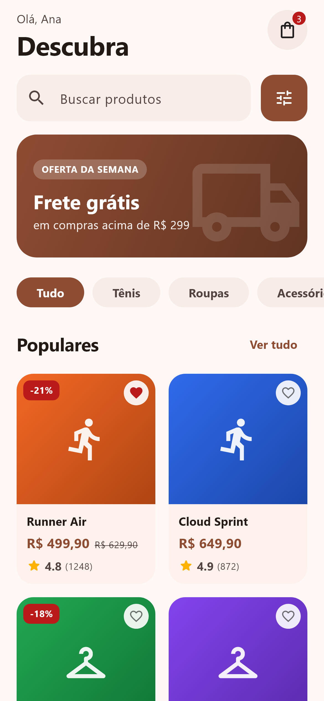
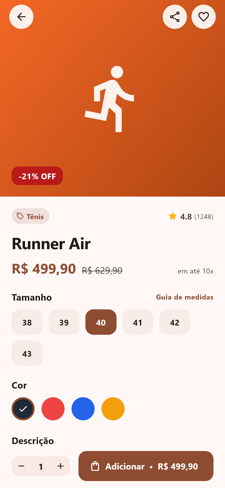
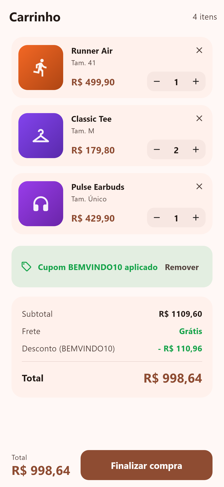
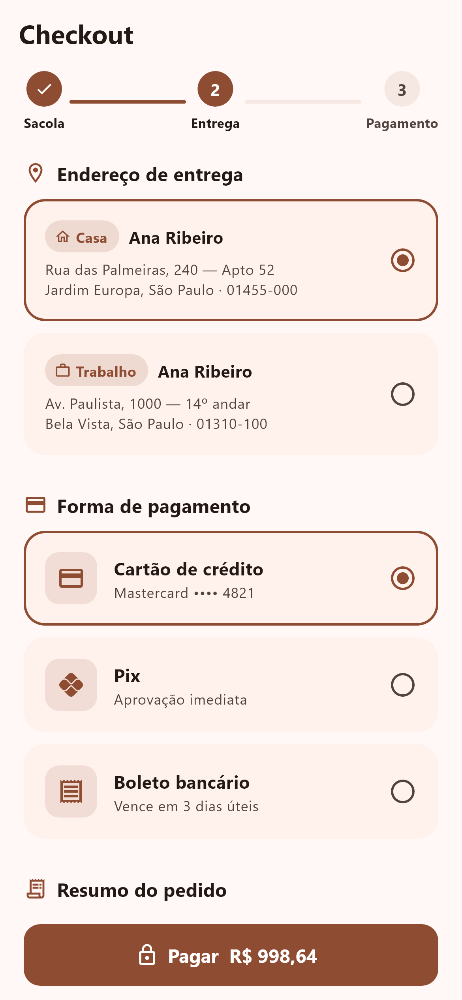
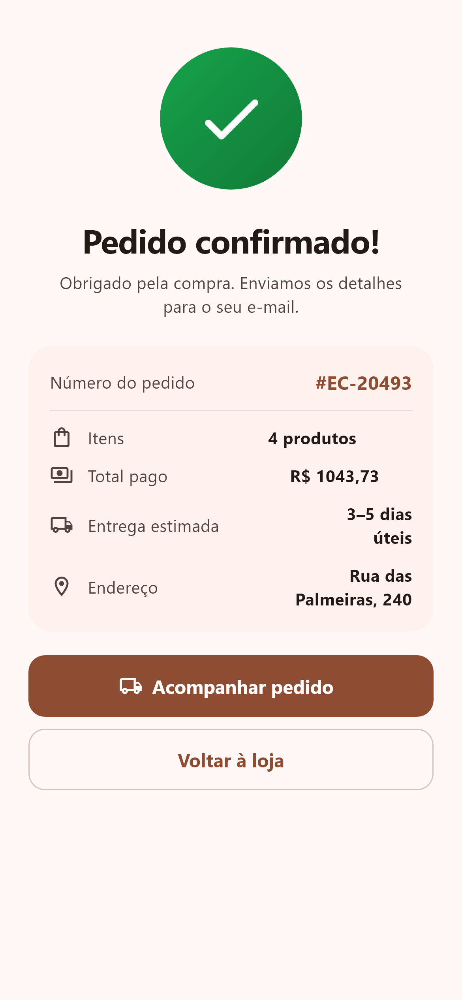
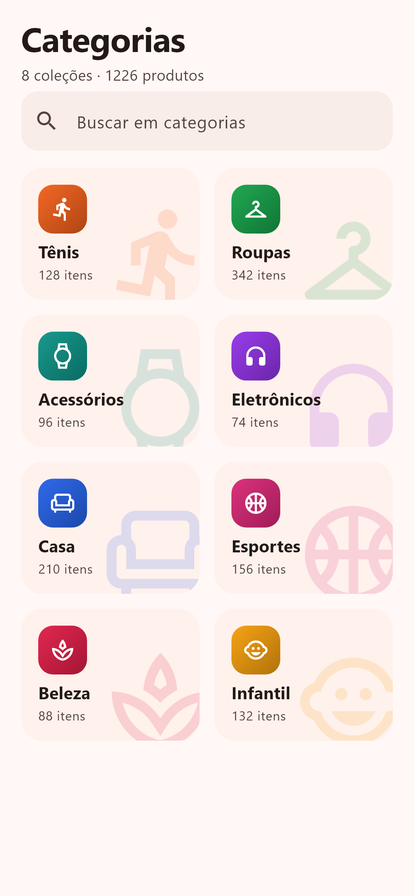

# Flutter Shop

[Leia em português](./README.pt-BR.md)

[](./LICENSE) 

Flutter Shop is a free e-commerce template built with Flutter 3.44 and Material 3. It implements a store with a purchase flow from storefront to order confirmation across 9 screens: product grid with search and categories, product page with size and color selectors, cart with coupon, checkout with address and payment, confirmation, category browsing, search with filters, favorites and a profile with order history. Data comes from a mocked service layer, so the app runs with no backend; the repository and service classes mark where a real API plugs in.

## Screens

9 screens. Five of them live as tabs inside `HomeShell` (a Material 3 `NavigationBar` with a badge on the cart tab); the rest are pushed go_router routes:

- Shop (home tab): storefront with search field, category shortcuts and the product grid.
- Product (`/product/:id`): product page with size and color selectors and a pinned add-to-cart bar.
- Cart (tab): line items, coupon field and order summary.
- Checkout (`/checkout`): address and payment form.
- Confirmation (`/confirmation`): order placed screen.
- Categories (tab): category list for browsing the catalog.
- Search (`/search`): search with filters.
- Favorites (tab): saved products.
- Profile (tab): account data and order history.

## Screenshots

The `screenshots/` folder contains 18 PNGs: a light and a dark capture of each screen, generated by `test/print_test.dart`. A sample:








## Tech stack

| Package | Version |
| --- | --- |
| Flutter | 3.44 (stable) |
| Dart SDK | `^3.12.2` |
| go_router | `^17.3.0` |
| provider | `^6.1.5+1` |
| http | `^1.6.0` |
| intl | `^0.20.3` |
| cupertino_icons | `^1.0.8` |
| flutter_lints (dev) | `^6.0.0` |

Material 3 is enabled through `useMaterial3: true` with a seed-based color scheme.

## Requirements

- Flutter SDK, stable channel. The template was built with Flutter 3.44; `pubspec.lock` resolves with Flutter 3.38.0 or newer and Dart `>=3.12.2 <4.0.0`.
- No backend, API keys or environment variables.
- The usual platform toolchains for the targets you build: Android SDK for APKs, Xcode on macOS for iOS, Chrome for web, Visual Studio with the C++ workload for Windows. The repo ships `android/`, `ios/`, `web/` and `windows/` folders.

## Getting started

```bash
flutter pub get
flutter run
```

`flutter run` uses the connected device. List targets with `flutter devices` and pick one with `-d`, for example `flutter run -d chrome` for web or `flutter run -d windows` for desktop.

## Builds

```bash
flutter build apk        # Android
flutter build ipa        # iOS (requires macOS and Xcode)
flutter build web        # web output in build/web
flutter build windows    # Windows desktop
```

## Tests

`flutter test` runs the widget tests in `test/widget_test.dart`. `test/print_test.dart` (with helpers in `test/golden_utils.dart`) renders every screen in both themes and writes the PNGs in `screenshots/`.

## Project structure

```
lib/
  main.dart                 # entry point
  app.dart                  # MaterialApp.router with light and dark themes
  core/
    router.dart             # go_router route table (shell + pushed routes)
    theme.dart              # AppTheme: seed color and component themes
  data/
    models/                 # API models with fromJson/toJson
    services/               # http-based ShopApiService (mocked)
    repositories/           # ShopRepository consumed by the view models
  domain/
    models/                 # Product, CartItem, Order, ShopCategory
  ui/
    core/widgets/           # shared widgets
    features/home/          # HomeShell with the 5-tab NavigationBar
    features/<feature>/
      views/                # one screen per feature
      view_models/          # ChangeNotifier view models (MVVM)
```

## Architecture and state management

The code follows a layered architecture (data, domain, ui) with MVVM. Each screen has a `ChangeNotifier` view model injected via `provider`; view models call `ShopRepository`, which maps API models from the service layer into domain models. Navigation is declarative with go_router: `/` renders `HomeShell` with the five tabs, while product, search, checkout and confirmation are pushed on top of it.

## Theming and customization

The theme is centralized in `lib/core/theme.dart`. Colors derive from a single seed color (`AppTheme.seed`, `0xFFF2601A`); change it and `ColorScheme.fromSeed` regenerates both the light and the dark palettes. The same file sets the font family (Roboto) and the component themes for buttons, inputs and cards. The app follows the system brightness because `app.dart` passes both `theme` and `darkTheme` to `MaterialApp.router`. Prices are formatted with `intl`.

## More templates

This template is part of the catalog at https://template.dev.br, which lists free and paid templates with previews.

## Support this project

Donations keep the free templates maintained and compatible with new Flutter releases. If this one is useful to you, you can contribute any amount at https://template.dev.br/doar?template=flutter-ecommerce.

## License

MIT, see [LICENSE](./LICENSE). Copyright 2026 Danilo Quinelato.
